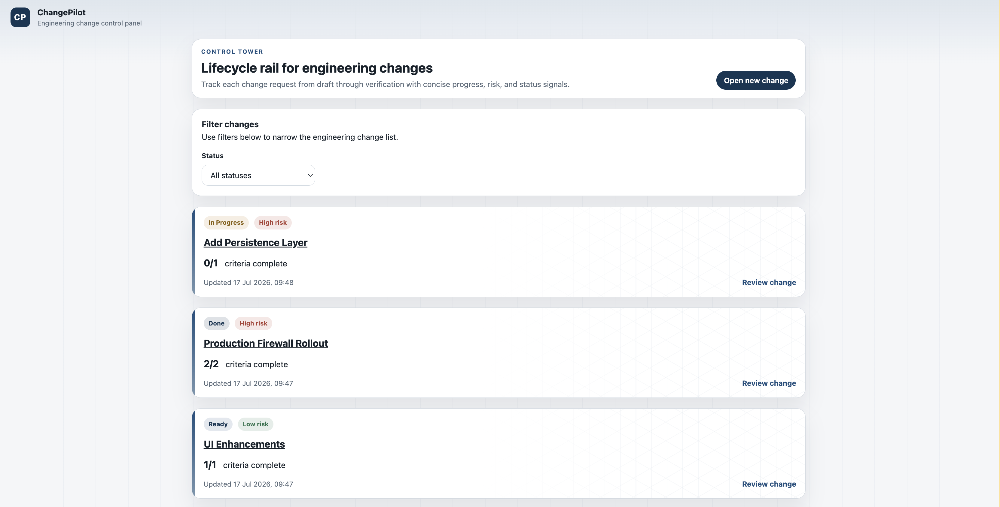

# ChangePilot

ChangePilot is a small engineering change management application with a Spring Boot API and a React/Vite frontend.



## Repository structure

- `changepilot-api/` - Java 21, Spring Boot, Maven Wrapper backend.
- `changepilot-frontend/` - React, TypeScript, Vite frontend.
- `changepilot-deployment/` - Dockerfiles, Compose files, deploy scripts, and deployment notes.

## Stack

- Backend: Java 21, Spring Boot 3, Spring Data JPA, H2, springdoc OpenAPI.
- Frontend: React 18, TypeScript, Vite 5, Vitest, ESLint.
- Deployment: Docker, Docker Compose, nginx.

## Quick start

From the repository root:

```bash
./changepilot-deployment/docker/deploy.sh up
```

Forced rebuild:

```bash
./changepilot-deployment/docker/deploy.sh up --build
```

Stop and remove containers:

```bash
./changepilot-deployment/docker/deploy.sh down
```

PowerShell equivalents:

```powershell
./changepilot-deployment/docker/deploy.ps1 up
./changepilot-deployment/docker/deploy.ps1 up -Build
./changepilot-deployment/docker/deploy.ps1 down
```

## Default URLs

- Frontend: `http://localhost:5173`
- API: `http://localhost:8080/api/engineering-changes`
- Swagger UI: `http://localhost:8080/swagger-ui.html`
- OpenAPI: `http://localhost:8080/v3/api-docs`

## Configuration

Compose defaults work without a `.env` file. Optional overrides can be placed in `changepilot-deployment/docker/compose/.env` based on `.env.example`.

Important variables:

- `CHANGEPILOT_API_PORT` - host port mapped to the API container. Default `8080`.
- `CHANGEPILOT_FRONTEND_PORT` - host port mapped to the frontend container. Default `5173`.
- `VITE_API_BASE_URL` - browser-facing API origin used by the frontend. Default `http://localhost:8080`.
- `CHANGEPILOT_ALLOWED_ORIGIN` - backend CORS origin. Default `http://localhost:5173`.

If you change the frontend or API host ports, also update `VITE_API_BASE_URL` and `CHANGEPILOT_ALLOWED_ORIGIN` to matching host URLs.

## Direct Compose commands

Local development layering:

```bash
docker compose \
  -f changepilot-deployment/docker/compose/docker-compose.base.yaml \
  -f changepilot-deployment/docker/compose/docker-compose.local.yaml \
  up -d --build
```

Production-like runtime only:

```bash
docker compose -f changepilot-deployment/docker/compose/docker-compose.base.yaml up --build
```

## Backend commands

```bash
cd changepilot-api
./mvnw test
./mvnw verify
```

## Frontend commands

```bash
cd changepilot-frontend
npm run lint
npm run test
npm run build
```

## Local Docker reload and restart behavior

- Frontend local Docker uses the Vite development server with polling enabled, served through the default host URL `http://localhost:5173`, so source changes reload automatically in the browser.
- Backend local Docker mounts the source tree and runs `spring-boot:run`; source changes are picked up after restarting the API container or rerunning `deploy.sh up --build`.
- Runtime-only Compose builds immutable production images for both services.

## Known limitations

- The backend uses in-memory H2 storage intended for local/demo use.
- No authentication or authorization is included.
- The local API container does not provide hot reload; restart is required after backend source changes.

See `changepilot-deployment/README.md` for deployment details and troubleshooting.
